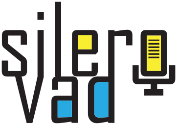

# silero-vad-python



A Python wrapper for the Silero Voice Activity Detector (VAD) model, providing an easy-to-use interface and command-line tools for detecting speech segments in audio files.

## Installation

1.  **Clone the repository:**
    ```bash
    git clone https://github.com/MohammadRaziei/silero-vad-python
    cd silero-vad-python
    ```

2.  **Install dependencies:**
    ```bash
    pip install -r requirements.txt
    ```